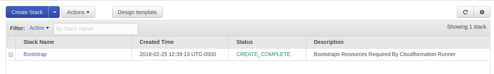
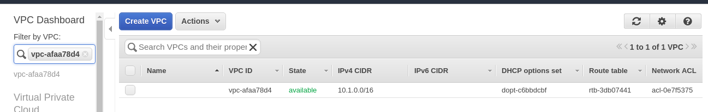
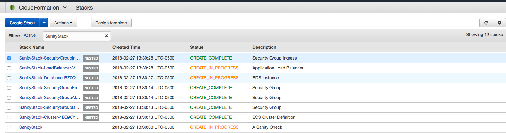
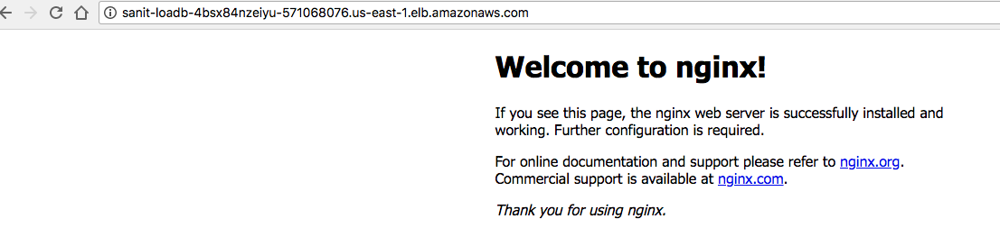

# cloudformation

## Introduction

The cloudformation "runner" is a cli-tool, whose primary purpose is to inject input parameters and orchestrate against AWS cloudformtion. It accomplishes this by using a small python [script](./src/cloudformation.py), `./src/cloudformation.py`, that takes a dictionary defined in `profiles`, and injects/interpolates a template defined in `templates`; the end result is uploaded to S3 and run against AWS Cloudformation.

While this repository provides the tools needed to execute the runner, it will mostly be leveraged by externanl [projects](https://github.com/callowaylccocoon-cloudformation) to orchestrate service-specific constructs, that use nested cloudformation-stacks defined [here](./templates). Finally, the runner has been encapsulated within a docker container to deal with dependency issues and its intended execution target (where it is run), will be either our CICD [environment](https://circleci.com) environment, or on the dev machine of an operator with the appropriate AWS permissions. A [shell wrapper](./bin/cloudformation.sh) has been provided as a convenience for executing the CLI, while abstracting away the need to deal with docker commands and creating an AWS session.

Finally, the purpose of this repository is to bootstrap an AWS account and provide the tooling and templates required by external projects to orchestrate cloudformation. In order to follow the steps below, to bootstrap an AWS account, you will need an IAM user that has permissions to assume the `admin` role (subjet to change).

If you are unfamiliar with setting up an AWS [profile](https://docs.aws.amazon.com/cli/latest/userguide/cli-chap-getting-started.html), please consult the documentation or query operations, as it can be tricky. The profile in question **must** be able to assume the admin role and it **must** have an MFA defined.

Below is an example of an AWS profile defined in `~/.aws/config`.

```bash
$ cat ~/.aws/config | awk '/test/{y=1}y'
[profile test]
source_profile = test
role_arn=arn:aws:iam::111111111111:role/admin
mfa_serial=arn:aws:iam::111111111111:mfa/christian
```

** Obviously you will need the aws [cli](https://docs.aws.amazon.com/cli/latest/userguide/installing.html) as well **

## Setup

1\. Clone the repository.
```bash
$ git clone git@github.com:callowaylc/cloudformation
Cloning into 'cloudformation'...
remote: Counting objects: 136, done.
remote: Compressing objects: 100% (80/80), done.
remote: Total 136 (delta 62), reused 120 (delta 49), pack-reused 0
Receiving objects: 100% (136/136), 334.46 KiB | 3.41 MiB/s, done.
Resolving deltas: 100% (62/62), done.
$ cd ./cloudformation
```

2\. Setup dependencies.
```bash
$ make
```

3\. Build the CLI.
```bash
$ AWS_PROFILE=test make build
Building base
Step 1/21 : FROM python:3.6.4-alpine3.7
...
```

4\. Test that the CLI is working.
```bash
$ AWS_PROFILE=test ./bin/cloudformation.sh
Usage: cloudformation.py [OPTIONS] COMMAND [ARGS]...

Options:
  --loglevel [DEBUG|INFO|WARNING|ERROR]
  --help                          Show this message and exit.

Commands:
  cloudformation  Orchestrates AWS Cloudformation Profiles
  securitygroup   Orchestrates AWS Security Group Profiles
  waf             Manages A Cloudfront Distribution's WAF IPSet
```

5\. Install the CLI to your local path.
```bash
$ make install
ln -fs `pwd`/bin/cloudformation.sh /usr/local/bin/cloudformation
```

6\. Test that the CLI is working against your local path.
```bash
$ AWS_PROFILE=test cloudformation
Usage: cloudformation.py [OPTIONS] COMMAND [ARGS]...

Options:
  --loglevel [DEBUG|INFO|WARNING|ERROR]
  --help                          Show this message and exit.

Commands:
  cloudformation  Orchestrates AWS Cloudformation Profiles
  securitygroup   Orchestrates AWS Security Group Profiles
  waf             Manages A Cloudfront Distribution's WAF IPSet
```

## Bootstrap An AWS Account

1\. Open `profiles/bootstrap.yaml` and change `Account` and `Role` to match the account you're targeting.

```yaml
Account: 111111111111
Role: arn:aws:iam::111111111111:role/cloudformation
Region: us-east-1
Template: bootstrap.yaml.j2
Stack: Bootstrap
Inputs:
  Organization: cloudformation
  Name: cloudformation
  CidrBlockVpc: 10.1.0.0/16
  CidrBlockSubnet1: 10.1.1.0/24
  CidrBlockSubnet2: 10.1.2.0/24
```

If you wish to change the CIDR block, go ahead.

2\. Bootstrap the target account.
```bash
$ AWS_PROFILE=test make bootstrap
{"message": "Enter", "time": "2018-03-27 15:39:22.211428", "trace": "cloudformation#main"}
...
{"message": "Waiting for stack orchestrating to complete", "time": "2018-03-27 15:39:22.568661", "trace": "aws#cloudformation_orchestrate", "waiter": "<botocore.waiter.CloudFormation.Waiter.StackUpdateComplete object at 0x7f561cd52128>"}
```

This will create a cloudformation stack named `Bootstrap`, that creates an ECR Repository `cloudformation/cloudformation`, a "bootstrap" VPC and associated IGW, Subnets, et al. In addition, the bootstrap will setup various roles with elevated and/or explicit permissions, which include the roles `cloudformation`, `ecr` and `rds-monitoring`. These roles are intended be "assumed" by the operator when performing actions against the account, with the roles' name serving as a descriptor of the type of action; for example, the `cloudformation` role is assumed by users with the requisite permissions, to perform orchestrate cloudformation templates. The bootstrap will also create two bucket, cloudformation-cloudformation-$acountid-$region and cloudformation-lambda-$accountid-$region, which will respectively store cloudformation templates and lambda functions.

**Cloudformation**


**ECR**


**VPC**


## Deploy Generic Templates

The `templates` directory contains "generic" templates, such as definitions for security groups, load balancers, subnets, etc, that will be used in [nested stacks](https://docs.aws.amazon.com/AWSCloudFormation/latest/UserGuide/using-cfn-nested-stacks.html) to define concrete services. To make these generic templates available for later use, they must be deployed to a pre-agreed upon location in S3.

To publish generic templates to S3:

1\. Call `make publish`.
```bash
$ AWS_PROFILE=test make publish
upload: templates/alb-target-group.yaml to s3://cloudformation-cloudformation-111111111111-us-east-1/alb-target-group.yaml
upload: templates/ecs-service.yaml to s3://cloudformation-cloudformation-111111111111-us-east-1/ecs-service.yaml
upload: templates/ecs.yaml to s3://cloudformation-cloudformation-111111111111-us-east-1/ecs.yaml
...
```

Looking at the above, you'll notice that `template/*.yaml` is being uploaded to a bucket `s3://cloudformation-cloudformation-111111111111-us-east-1`; this bucket was generated during the bootstrapping process and will be used, going forward, by the account `111111111111` to resolve S3 templates when executing cloudformation. Obviously, if you are using a different AWS account, the bucket name will change to reflect that account id.

## Deploy The cloudformation CLI

The cloudformation cli is a small python [script](./src/cloudformation.py), that ties all of these pieces together; in a nutshell, it takes inputs, produces outputs and then sends those outputs to AWS cloudformation. The cli will be used by downstream projects to do exactly the same, but in those cases, it will be building concrete services based on the generic templates we just deployed. To deal with inevitable dependency headaches with downstream operators, the runner has been packed as a docker image, which will be published to a private AWS repository (ECR).

To deploy the cli:

1\. Execute `make login` to login to AWS ECR.
```bash
$ AWS_PROFILE=test make login
Enter MFA code for arn:aws:iam::111111111111:mfa/christian:
WARNING! Using --password via the CLI is insecure. Use --password-stdin.
Login Succeeded
```

* Don't worry about warning message above if you get the same thing.

2\. Execute `make test` to execute the pytest test suite.
```bash
$ AWS_PROFILE=test make test
...
=============================== test session starts ===============================
platform linux -- Python 3.6.4, pytest-3.3.2, py-1.5.3, pluggy-0.6.0
rootdir: /opt/bin, inifile:
collected 12 items

tests/test_aws.py ..                                                        [ 16%]
tests/test_logger.py .                                                      [ 25%]
tests/test_cloudformation.py .....                                                   [ 66%]
tests/test_templates.py .                                                   [ 75%]
tests/test_util.py ...                                                      [100%]
christians-MacBook-Pro:cloudformation christian$
============================ 12 passed in 8.45 seconds ============================
```

* Remember that the runner is just plain-old-python code and it should be run through a test suite before artifacts are generated!

3\. Execute `make build` to build the runner image.
```bash
$ AWS_PROFILE=test make build
Building base
Step 1/21 : FROM python:3.6.4-alpine3.7
 ---> 02e54b114dbc
...
Successfully tagged cloudformation/cloudformation:latest
```

4\. Execute `make tag` to tag image with appropriate ECR URL.
```bash
$ AWS_PROFILE=test make tag
docker tag cloudformation/cloudformation 111111111111.dkr.ecr.us-east-1.amazonaws.com/cloudformation/cloudformation:latest
docker tag cloudformation/cloudformation 111111111111.dkr.ecr.us-east-1.amazonaws.com/cloudformation/cloudformation:`git rev-parse --short HEAD`
```

5\. Confirm that ECR image is available.
```bash
$ docker images | awk '/ecr.+?cloudformation/'
111111111111.dkr.ecr.us-east-1.amazonaws.com/cloudformation/cloudformation   2003fb5             01734e58e0e7        26 hours ago        489MB
111111111111.dkr.ecr.us-east-1.amazonaws.com/cloudformation/cloudformation   2270bf3             01734e58e0e7        26 hours ago        489MB
111111111111.dkr.ecr.us-east-1.amazonaws.com/cloudformation/cloudformation   latest              01734e58e0e7        26 hours ago        489MB
```

**Take notice of the ECR URL, which is required to resolve against the correct repository.**

6\. Execute `make push` to publish the runner image to ECR.
```bash
$ AWS_PROFILE=test make push
The push refers to repository [111111111111.dkr.ecr.us-east-1.amazonaws.com/cloudformation/cloudformation]
2a30b91ffc70: Layer already exists
...
latest: digest: sha256:d7df766456d5a24b6a90cb55073bf800912bcac0b0037e36001d15e9dfb06cbc size: 2403
```

## Orchestrating A Stack

The purpose, or end result, of the cloudformation runner, is to create a stack in AWS Cloudformation, that defines infrastrucure constructs; for example, we could define an ALB (Application Load Balancer) and 2 EC2 instances, of which the latter are registered with the ALB and requests are round-robbined between them.

In fact, we have already done when we "bootstrapped" the account! The bootstrap created, amongst other things, an S3 bucket and ECR repository, so as to make our previous steps possible.


While we won't get into the mechanics of "orchestrating a stack" (see sanity check section below), we will go over how the operation is initiated. To orchestrate a stack, we call `make orchestrate $profile`, where are our profile is a yaml file defined in the `profiles` directory.

For example, we can orchestrate the `bootstrap.yaml` profile doing the following:
```bash
$ AWS_PROFILE=test make orchestrate bootstrap.yaml
{"message": "Enter", "time": "2018-03-27 15:53:53.576618", "trace": "cloudformation#main"}
{"message": "Exit", "time": "2018-03-27 15:53:53.576820", "trace": "cloudformation#main"}
...
{"message": "Failed to orchestrate stack", "trace": "runner#main", "error": "Exception: An error occurred (InsufficientCapabilitiesException) when calling the UpdateStack operation: Requires capabilities : [CAPABILITY_NAMED_IAM]", "time": "2018-02-27 17:26:43.419404"}
```

This is **almost** the same process that occurs when you bootstrapped the account by calling `make bootstrap`, though you will notice that this time the operation ends with the error above. That's ok and expected which is why we used `make bootstrap` in the first place :)

## The cloudformation CLI

The cloudformation cli is a "comprehensive" command-line tool, intended to encapsulate operations against AWS infrastructural constructs, such as orchestrating a cloudformation template, updating ingress points on a security group or changing a WAF rule's IPSet.

```bash
$ AWS_PROFILE=test cloudformation --help
Usage: cloudformation.py [OPTIONS] COMMAND [ARGS]...

Options:
  --loglevel [DEBUG|INFO|WARNING|ERROR]
  --help                          Show this message and exit.

Commands:
  cloudformation  Orchestrates AWS Cloudformation Profiles
  securitygroup   Orchestrates AWS Security Group Profiles
  waf             Manages A Cloudfront Distribution's WAF IPSet
```

In fact, our previous operations to [bootstrap an account](#bootstrap-an-aws-account) or [orchestrate a stack](#orchestrate-a-stack) used the cloudformation cli as an engine to power those results.

For example, when we bootstrapped the account, we did the following.
```bash
$ AWS_PROFILE=test make bootstrap
{"message": "Enter", "time": "2018-03-27 18:27:45.573795", "trace": "cloudformation#main"}
{"message": "Exit", "time": "2018-03-27 18:27:45.573980", "trace": "cloudformation#main"}
...
```

But in reality, we could accomplish the same by directly using the cloudformation cli.
```bash
$ AWS_PROFILE=test ./bin/cloudformation.sh --loglevel INFO cloudformation \
>         --disable-rollback \
>         --capabilities \
>         --disable-bucket \
>         --profile bootstrap.yaml
{"message": "Enter", "time": "2018-03-27 18:27:45.573795", "trace": "cloudformation#main"}
{"message": "Exit", "time": "2018-03-27 18:27:45.573980", "trace": "cloudformation#main"}
...
```

Of course, this is a lot of bother for dealing with updating things like security group ingress and waf rules; the subcommands `waf` and `securitygroup` offer simple wrappers to [boto3](https://boto3.readthedocs.io/en/latest/) for updating their respective attributes.

```bash
$ AWS_PROFILE=test ./bin/cloudformation.sh --help
Usage: cloudformation [OPTIONS] COMMAND [ARGS]...

Options:
  --loglevel [DEBUG|INFO|WARNING|ERROR]
  --profile TEXT                  Use a preconfigured profile.  [required]
  --dry                           Disables all mutative actions.
  --help                          Show this message and exit.

Commands:
  cloudformation  Orchestrates AWS Cloudformation Profiles
  securitygroup   Orchestrates AWS Security Group Profiles
  waf             Manages A Cloudfront Distribution's WAF IPSet
```

We will delve more into the above functionality in the repositories maintained for [securitygroups](https://github.com/callowaylc/cf-sg) and [waf](https://github.com/callowaylc/cf-waf), though lets take a look at an example of listing all waf rules, for a given profile, `test.yaml`.

```bash
$ AWS_PROFILE=test ./bin/cloudformation.sh   --loglevel ERROR   --profile test.yaml waf --name Test
[
    "127.0.0.0/8",
    "192.168.0.0/16",
    "0000:0000:0000:0000:0000:0000:0000:0001/128",
    "192.167.0.0/16"
]
```
## A Sanity Check

So far there has been a lot of talk, but not a concrete example of what the runner really does; let's change that. In this excercise, we will "orchestrate a stack" against cloudformation, that will create the following:
  * A new stack called "Sanity" defined in `templates/sanity.yaml`.
  * A set of "nested" stacks, each composed of our "generic" templates that we previously deployed.
  * An ALB (Application Load Balancer) with an associated Target Group and HTTP Listener.
  * A FARGATE backed, ECS Cluster and associated Service and Task definitions.
  * An RDS instance.
  * A simple site with the nginx splash screen.

1\. To start, lets take a look at `profiles/test.yaml`.
```yaml
Account: 111111111111
Role: arn:aws:iam::111111111111:role/cloudformation
Region: us-east-1
Template: sanity.yaml.j2
Stack: SanityStack
Inputs:
  Name: Sanity
  DockerImage: nginx
  DockerTag: {{ ENV.TAG|default("latest") }}
  Port: "80"
  SubnetsExportName: SubnetIdsBootstrap
  VpcIdExportName: VpcIdBootstrap
  DatabaseUsername: /application/cocoon/database/username
  DatabasePassword: /application/cocoon/database/password
Config:
  Alb:
    SecurityGroupIngressPorts:
      - 80
      - 443
    SecurityGroupEgressPorts:
      - 80
```

This dictionary will be used by the runner to determine:
  - **where** the stack should be created (Account)
  - **which** stack to build (Template)
  - **what** data should be available during the orchestration process(Inputs).

Notice that `DockerTag` uses a jinja2 expression reference - profiles, like templates are rendered through jinja2, **BUT** only environment variables are available from the profile context. In general, this behavior is frowned upon, as the data profiles should strive to be static and simple; sometimes though, as in the case of a CICD pipeline where `DockerTag` is not known until runtime, we simply cannot avoid adding some dynanicism.

**Remember that the runner is run within a docker context, so you will need to explicitly pass environment variable values when running a container (via docker-compose.yaml)**

2\. Let's create a new profile to deploy to the **dev** account

Copy `profiles/test.yaml` to `profiles/dev.yaml`:
```bash
$ cp ./profiles/test.yaml ./profiles/dev.yaml
```

Update Account and Role values in `profiles/dev.yaml` to the appropriate account id:
```yaml
Account: 111
Role: arn:aws:iam::111:role/cloudformation
```

Finally, open a new branch and commit your work:
```bash
$ git checkout -b feature/add-dev-account
Switched to a new branch 'feature/add-dev-account'
$ git add .
$ git commit -am "Add Dev Profile"
[feature/add-dev-account 913613c] Add Dev Profile
 1 file changed, 21 insertions(+)
 create mode 100644 profiles/dev.yaml
```

3\. To get a better idea of what the stack will be creating.

First, open `templates/sanity.yaml.j2` and take a look at the parameter section, which we can find by searching for "Parameters:"
```yaml
...
Parameters:
  Name:
    Type: String
    Description: AWS ECS Task Name
  DockerImage:
    Type: String
    Description: Docker Image Repository URL
  DockerTag:
    Type: String
    Description: Docker Image Tag
    Default: latest
...
```

Referring back to the `dev.yaml` profile we created earlier, you should see the correlation between Inputs and Parameters.
```bash
$ cat ./profiles/dev.yaml
...
Inputs:
  Name: Sanity
  DockerImage: nginx
  Port: "80"
  SubnetsExportName: SubnetIdsBootstrap
  VpcIdExportName: VpcIdBootstrap
  DatabaseUsername: /application/cocoon/database/username
  DatabasePassword: /application/cocoon/database/password
...
```

Second, let's take a look at the load balancer definition, which you can find by searching for "LoadBalancer:".

```yaml
...
  LoadBalancer:
    Type: AWS::CloudFormation::Stack
    DependsOn:
      - SecurityGroupAlb
    Properties:
      TemplateURL:
        Fn::Sub: {{ ENV.LINK }}/alb.yaml
      Parameters:
        Name:
          Ref: Name
        SecurityGroups: !GetAtt SecurityGroupAlb.Outputs.SecurityGroupId
        Subnets:
          Fn::ImportValue: !Sub ${SubnetsExportName}
...
```

Above, we see that the LoadBalancer:
  - depends on another resource definition (SecurityGroupAlb)
  - uses the "generic" template defined in  `templates/alb.yaml`
  - passes data to the generic template (Properties)
  - depends upon the "output" of another generic template (SecurityGroupAlb.Outputs.SecurityGroupId)

As a whole, `sanity.yaml.j2` creates an aggregate of our generics to create a "concrete" service, which we will explore below.

If you are not familiar with Cloudformation Resources, please review the [appropriate](https://docs.aws.amazon.com/AWSCloudFormation/latest/UserGuide/GettingStarted.Walkthrough.html) AWS documentation.

Finally, let's take a look at another example in the sanity stack -  search for "SecurityGroupIngressAlb{{ port }}" and you should see something like the following:
```yaml
...
  
  SecurityGroupIngressAlb{{ port }}:
    Type: AWS::CloudFormation::Stack
    DependsOn:
      - SecurityGroupAlb
    Properties:
      TemplateURL:
        Fn::Sub: {{ ENV.LINK }}/security-group-ingress.yaml
      Parameters:
        Name: !Ref Name
        SecurityGroupId: !GetAtt SecurityGroupAlb.Outputs.SecurityGroupId
        Port: {{ port }}
        CidrIp: 0.0.0.0/0
  
...
```

If you are familiar with ansible, you'll know that the common programming idioms seen above are part of the [Jinja2](http://jinja.pocoo.org/docs/2.10/) template langauge. All stacks ending `j2`, such as the one we are looking at (`sanity.yaml.j2`),  with be run through the template engine, with the end result written to `build/$timestamp.$template_name`. This is the file that will be used against AWS Cloudformation, and will be done so regardless of whether any interpolation has occured. Long story short, looking at the transformed template in `build` is an excellent way to troubleshoot and perform sanity checks.

Looking at this specific example, notice that we are iterating over `Config.Alb.SecurityGroupIngressPorts`; if we take a look at `profiles/dev.yaml` again, you will notice the same construct defined in yaml:
```bash
$ cat ./profiles/dev.yaml
...
Config:
  Alb:
    SecurityGroupIngressPorts:
      - 80
      - 443
    SecurityGroupEgressPorts:
      - 80
```

So here we come to an **IMPORTANT** distinction: `Inputs` are intended to be used as a stack [parameter](https://docs.aws.amazon.com/AWSCloudFormation/latest/UserGuide/parameters-section-structure.html) during orchestration (on AWS); `Config` is intended to be used during template interpolation. You can mix-and-match, but please dont.

4\. Now that we have a good idea of how templates work, and the relationship between them, lets orchestrate the profile `dev.yaml`, which uses the `sanity.yaml.j2` stack.
```bash
$ AWS_PROFILE=test make orchestrate dev.yaml
{"message": "Enter", "arguments": {"profile": "dev.yaml", "capabilities": false, "disable_bucket": false, "timeout": 10, "template_path": "./templates:./cloudformation/templates", "disable_rollback": true}, "trace": "runner#main", "time": "2018-02-27 18:31:14.601088"}
{"message": "Enter", "file": "dev.yaml", "trace": "runner#load_profile", "time": "2018-02-27 18:31:14.601749"}
...
{"message": "Waiting for stack orchestrating to complete", "waiter": "<botocore.waiter.CloudFormation.Waiter.StackCreateComplete object at 0x7f4830201588>", "trace": "runner#orchestrate", "time": "2018-03-05 16:32:14.552169"}
```

5\. It will take about 10 minutes for the stack to complete - you can follow the progress on the cloudformation console or wait for the process to finish; if you notice above, the runner will poll cloudformation for a `done` state and not complete until it has reached that state, regardless of whether the stack has succeeded or failed.


Once we've reached a `CREATE_COMPLETE` state, we can verify that everything work, by querying our ALB DNS address.
```bash
$ AWS_PROFILE=test aws elbv2 describe-load-balancers --output text --query "LoadBalancers[*].[DNSName]" | grep -i sanit
Sanit-LoadB-4BSX84NZEIYU-571068076.us-east-1.elb.amazonaws.com
...
$ curl -Is Sanit-LoadB-4BSX84NZEIYU-571068076.us-east-1.elb.amazonaws.com
HTTP/1.1 200 OK
Date: Tue, 27 Feb 2018 18:52:52 GMT
Content-Type: text/html
Content-Length: 612
Connection: keep-alive
Server: nginx/1.13.9
Last-Modified: Tue, 20 Feb 2018 12:21:20 GMT
ETag: "5a8c12c0-264"
Accept-Ranges: byte
```

For a more visually pleasing proof, plugin the URL you get above into a browser.


6\. Now that we fulfilled our acceptance for the sanity stack, lets clean it up, since it costs money.
```bash
$ AWS_PROFILE=test make clean
```
